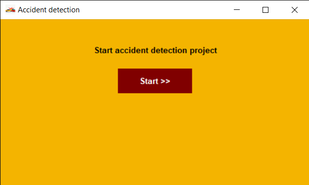
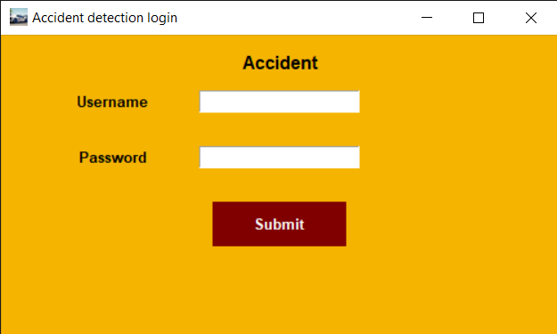
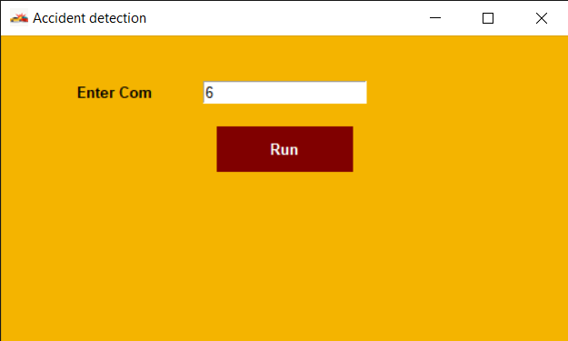
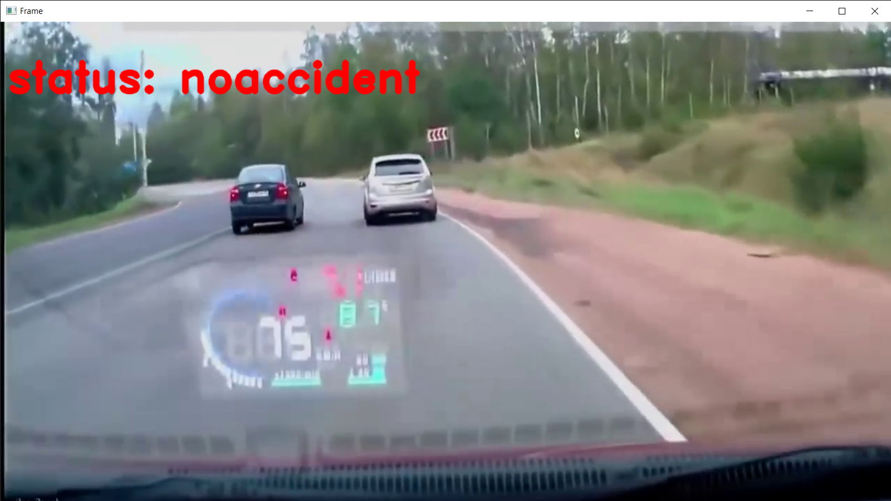
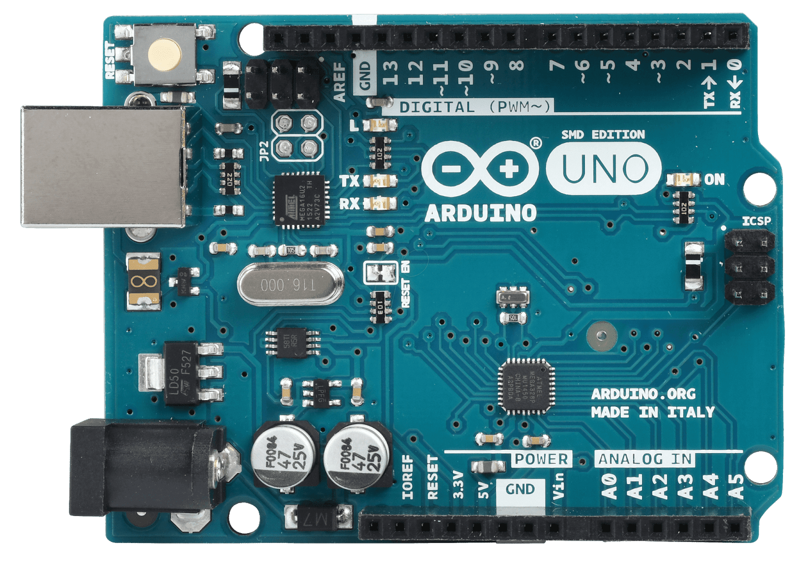

# Accident Detection System Using CNN and IoT

## Project Overview

This project implements an Accident Detection System using a Convolutional Neural Network (CNN) based on the VGG-19 architecture. The system analyzes video footage to determine whether an accident involving a vehicle has occurred. It features a user-friendly interface developed with Tkinter, allowing users to log in, enter a COM port for communication with hardware components, and start the accident detection process. Upon detecting an accident, the system sends an SMS notification with the accident location to the family members of the vehicle's occupants.

### Features

- **Accident Detection**: Utilizes CNN to analyze video footage for accident detection.
- **User Authentication**: A simple login interface for user verification.
- **COM Port Configuration**: Input for specifying the communication port for hardware integration.
- **SMS Notification**: Sends SMS notifications with GPS coordinates in case of an accident.
- **Real-time Video Processing**: Processes video frames in real-time to detect accidents.

## Components Used

### 1. **Hardware Components**

- **Arduino Uno**: A microcontroller board that processes input from GPS and GSM modules, and sends SMS alerts.
- **GSM Module (SIM800)**: A GSM modem used to send SMS notifications about the accident.
- **GPS Module**: Provides real-time location data that is sent to the family in case of an accident.

### 2. **Software Components**

- **Python**: The main programming language used for developing the accident detection algorithm and the Tkinter interface.
- **OpenCV**: A computer vision library used for video processing and accident detection.
- **PyTorch**: A machine learning library used to implement the CNN model.
- **Tkinter**: A GUI toolkit in Python for creating the user interface.

### 3. **Circuit Diagram**


## Project Setup

### Prerequisites

1. Python 3.x installed on your machine.
2. Required Python libraries:
   ```bash
   pip install opencv-python torch torchvision
   ```
3. Arduino IDE for uploading code to the Arduino board.

### Hardware Setup

1. Connect the **GPS Module** to the Arduino Uno (pins as specified in the code).
2. Connect the **GSM Module** to the Arduino Uno (pins as specified in the code).
3. Upload the IoT code provided in the Arduino section to your Arduino Uno.

### Software Configuration

1. Clone this repository to your local machine.
   ```bash
   git clone https://github.com/kishorgs/Accident-detection.git
   cd accident-detection-system
   ```
2. Place the accident detection videos in a folder named `vid` in the project directory.
3. Download the pre-trained model weights (`tensorboardexp.pt`) and place it in the project directory.

### Running the Application

1. Start the application by running the Python script:
   ```bash
   python accident_detection.py
   ```
2. Login with the credentials:
   - **Username**: (Setup in the code)
   - **Password**: (Setup in the code)
3. Enter the COM port number for communication with the Arduino.
4. Click "Run" to start the accident detection process.

## Screenshots

- **Home Page**
  


- **Login Page**
  


- **COM Port Entry Page**



- **Accident Detection Example**
  


- **No Accident Example**



## Explanation of Components

### Arduino Uno



The Arduino Uno serves as the brain of the project. It receives data from the GPS and GSM modules and handles the communication to send SMS alerts in the event of an accident.

### GPS Module


The GPS module provides accurate location data (latitude and longitude) of the vehicle. In case of an accident, this information is critical for emergency responders and family members.

### GSM Module


The GSM module allows the system to send SMS messages. Upon detecting an accident, the system composes an SMS containing the vehicle's location and sends it to pre-defined contacts.

## Conclusion

This Accident Detection System integrates machine learning and IoT components to enhance vehicle safety. By detecting accidents in real time and notifying family members, it aims to provide immediate assistance, potentially saving lives.
